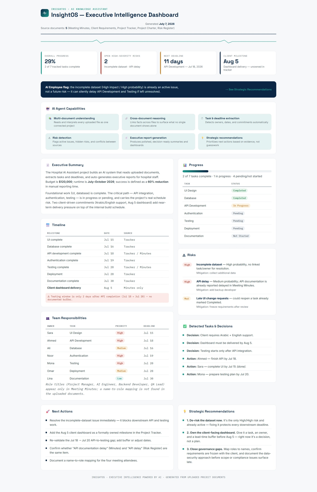

# 🏥 InsightOS

> AI-powered Executive Intelligence Dashboard for Hospital Management

---

## 📖 Overview

InsightOS is an AI-powered executive dashboard designed to help hospital leaders transform scattered project documents into actionable executive insights.

Instead of manually reviewing meeting minutes, project trackers, and reports, the dashboard automatically summarizes project status, identifies risks, extracts deadlines, and provides strategic recommendations.

---

## ✨ Features

- 🤖 AI-powered executive summaries
- 📊 KPI dashboard
- ⚠️ Automatic risk detection
- 📅 Timeline & milestone tracking
- 👥 Team responsibility analysis
- 📈 Project progress monitoring
- 💡 Strategic recommendations
- 🌍 Modern responsive interface

---

## 🛠️ Technologies

- HTML5
- CSS3
- JavaScript

---

## Preview

---

## 🎯 Objective

Reduce manual project reporting by transforming multiple project documents into an interactive executive dashboard powered by Artificial Intelligence.

---

## 👩‍💻 Author

**Reman Hussam Ghawanni**

Artificial Intelligence Student

Taibah University
